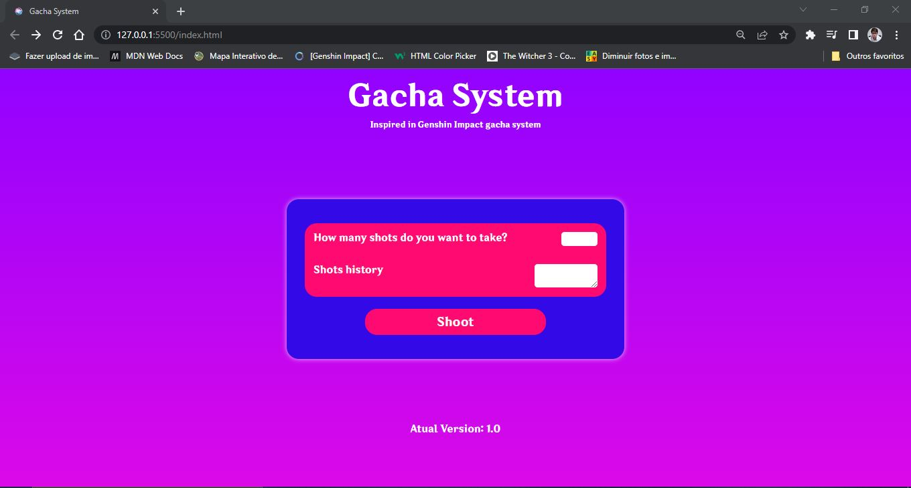
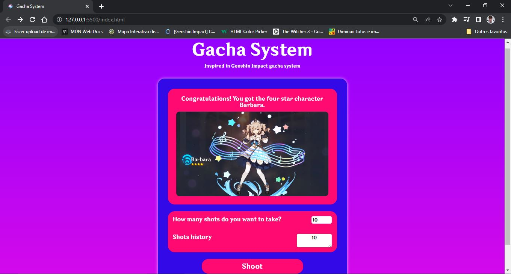
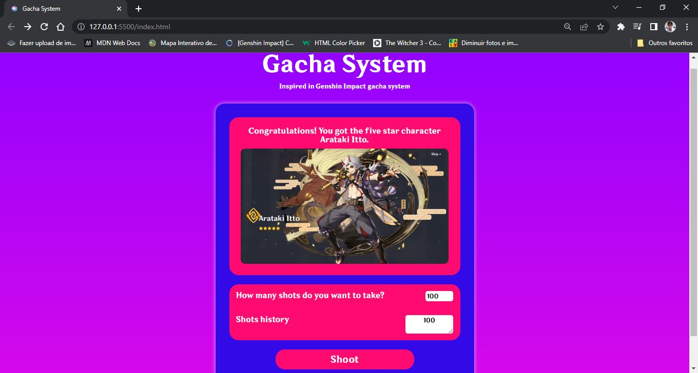
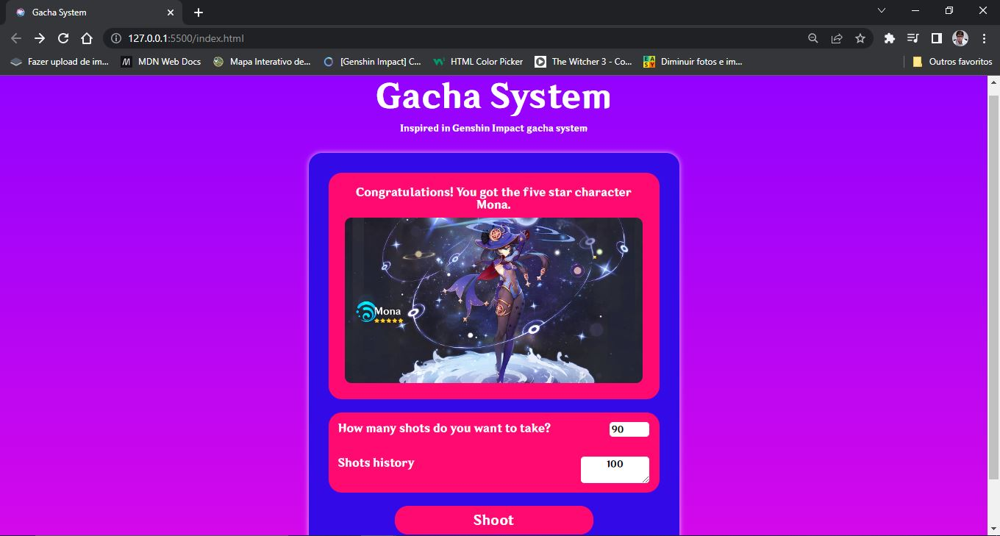
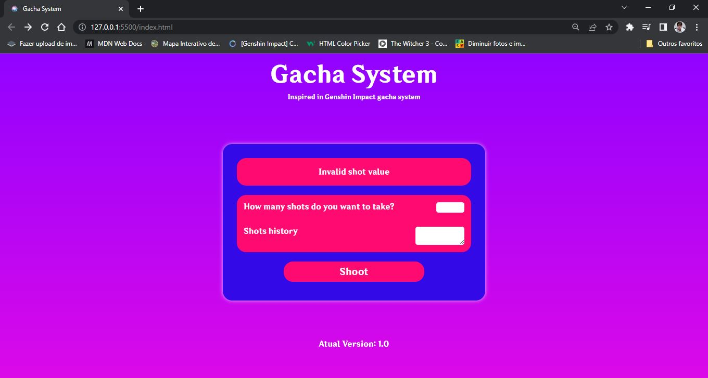

<h1 align = "center"> Hello guys! Welcome to my project. </h1>
 
<h2 align = "center"> In this project I made a Gacha System with Javascript</h2>
 
<h3 align = "center"> Version 1.0 is out!</h3>
 

 In this version all the structures were changed to improve the functioning of the gacha and with that new variables were added to help this functioning.
And the biggest change was the addition of the structure responsible for making the images of the respective characters taken in gacha appear. Bellow you can see a demo gif of the project and some screenshots
This is not yet the final version of the project!

 

<video src="/public/images/demogif.gif" width="500px">

 

 
 

 
 

 
 

 

