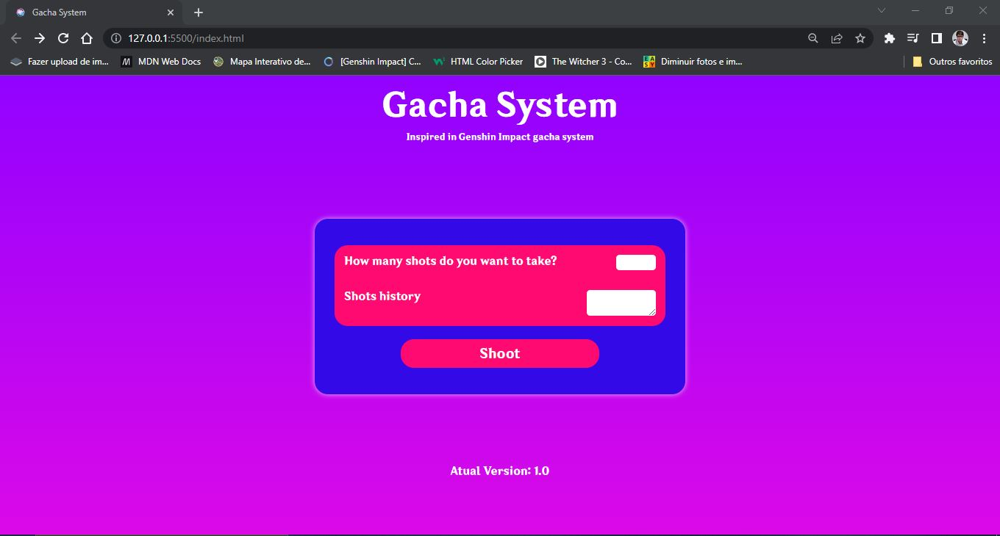
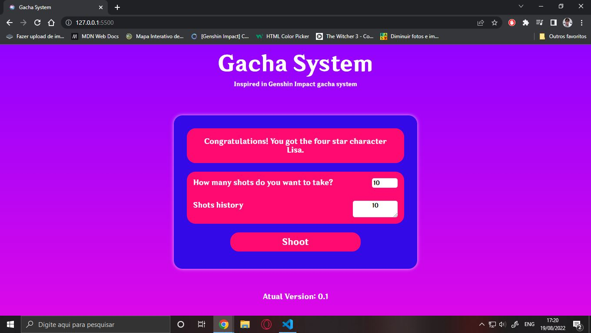
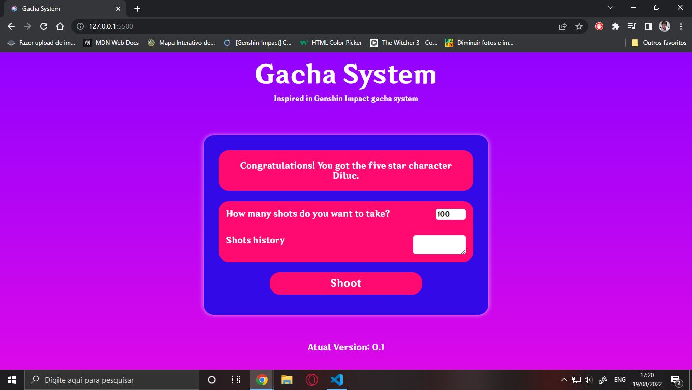
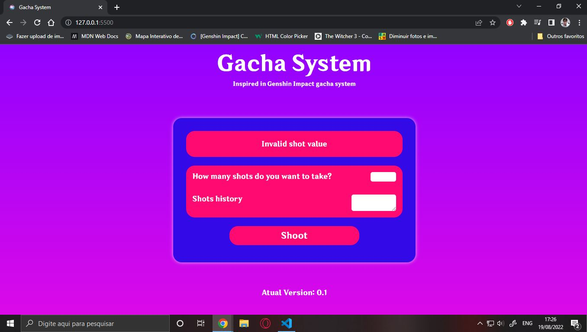

<h1 align = "center"> Hello guys! Welcome to my project. </h1>
 
<h2 align = "center"> In this project I made a Gacha System with Javascript</h2>
 

This is version 0.1 of the project. I plan to update it in the future.
The gacha system works like this: if you shoot 10 shots, you get a four star character. When you hit the 100-shot mark or take 100 shots at once, you get a five-star character.
The system was inspired by Genshin Impact. The images below show how the project works.

 

 
 

 
 

 
 

 

